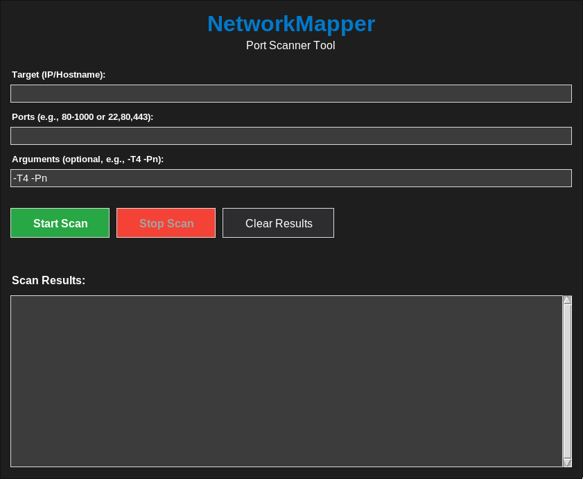
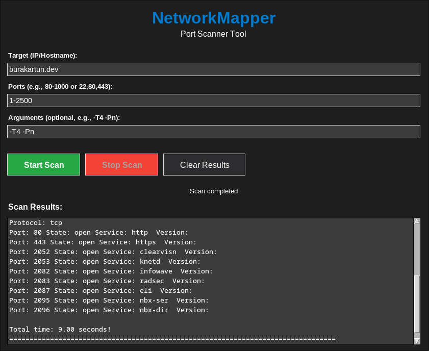

# NetworkMapper

NetworkMapper is a Python-based network port scanner with both a modern dark-themed GUI and a command-line interface. It uses the `python-nmap` library to scan specific ports on a given target and retrieve information such as state, service name, and version.

## Features

- Modern GUI (Tkinter)
- CLI-based port scanning
- Displays open ports, service names, and versions
- Custom port selection via command-line arguments

## Requirements

- Python 3.8 or higher
- Nmap installed on the system
- Required Python packages:
  - `python-nmap`
  - `pyfiglet`
  - `tkinter` (usually comes with Python, but may require `tk` package on some systems)

## Installing Dependencies

First, make sure Nmap is installed on your system:

- Debian/Ubuntu:
  ```bash
  sudo apt install nmap tk
  ```
- macOS:
  ```bash
  brew install nmap
  ```
- Windows:
  Download and install from [https://nmap.org/download.html](https://nmap.org/download.html)

Then install Python dependencies:
```bash
pip install -r requirements.txt
```

## Usage

### GUI Mode (Recommended)

```bash
python main.py
```

- The GUI features a dark theme for comfortable use.
- You can start and stop scans using the provided buttons.

### Command Line Mode

```bash
python modules/run_cli.py [target] -p [ports]
```

#### Examples

Scan a range of ports:
```bash
python modules/run_cli.py 192.168.1.1 -p 1-1000
```

Scan specific ports:
```bash
python modules/run_cli.py example.com -p 22,80,443
```

## Project Structure

```
.
├── modules/           # All models are here
│   ├── gui.py         # GUI application
│   ├── greeting.py    # Contains banner and usage text
│   ├── scanner.py     # Handles port scanning logic
│   ├── run_cli.py     # CLI entry point script
│   └── __pycache__/   # Ignored compiled Python files
├── main.py            # Main entry point (launches GUI)
├── requirements.txt   # Python dependencies
├── .gitignore         # Git ignore rules
└── __pycache__/       # Ignored compiled Python files
```

## Screenshots




## To-Do

- [x] Backend 
- [x] GUI
- [ ] Advanced scan options
- [ ] Export results